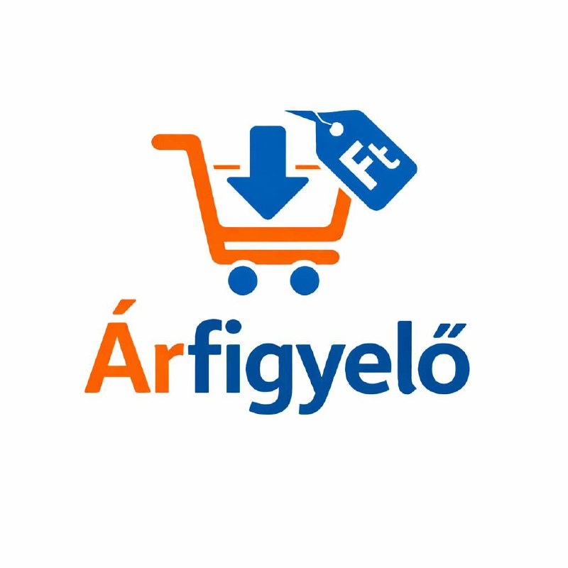

# 🇭🇺 GVH Árfigyelő – Hungarian Price Monitor



**Track daily prices on Hungary's official GVH Árfigyelő system. Get Telegram alerts when prices drop, new products appear, or a price falls below your target.**

> Covers Auchan, Tesco, Lidl, Aldi, Spar, Penny — ~2,000 food products, updated daily by law.

---

## 🔍 What it does

This Actor monitors [arfigyelo.gvh.hu](https://arfigyelo.gvh.hu) — Hungary's official government price comparison system operated by the GVH (Competition Authority). Retailers are legally required to upload daily prices, making this one of the most reliable and complete grocery price datasets in Hungary.

| Feature | Detail |
|---|---|
| **Sources** | arfigyelo.gvh.hu (official GVH data) |
| **Retailers** | Auchan, Tesco, Lidl, Aldi, Spar, Penny |
| **Products** | ~2,000 food items across 78 categories |
| **Update frequency** | Daily (retailers upload by midnight) |
| **Proxy needed** | ❌ No — government site, no bot protection |

---

## ✅ Key features

- **Price drop alerts** — notify when any product drops by X% or more since last run
- **Price target alerts** — notify when a product falls below your target price in HUF
- **New product alerts** — notify when a new product appears in a category
- **Delta mode** — KV Store tracks price history; only changed items saved each run
- **Telegram alerts** — instant formatted messages with product name, old/new price, % change
- **Webhook support** — push data to Zapier, Make, n8n
- **Keyword + retailer filter** — monitor only what matters to you

---

## 📦 Output fields

```json
{
  "id": "abc123",
  "product_id": "12345",
  "name": "Csirkemell filé",
  "retailer": "auchan",
  "retailer_label": "Auchan",
  "category": "Húsok és húskészítmények",
  "price_current": 1899,
  "price_previous": 2190,
  "price_loyalty": 1750,
  "price_unit": 949,
  "unit": "kg",
  "price_drop_pct": 13,
  "ean": "5999123456789",
  "url": "https://arfigyelo.gvh.hu/termek/12345",
  "scraped_at": "2025-04-15T06:00:00.000Z"
}
```

---

## 🚀 Example configurations

### Daily deal tracker — alert on 5%+ drops
```json
{
  "delta_mode": true,
  "alert_price_drop_pct": 5,
  "telegram_bot_token": "YOUR_BOT_TOKEN",
  "telegram_chat_id": "YOUR_CHAT_ID"
}
```

### Target price watcher — csirkemell under 2000 Ft
```json
{
  "keywords": ["csirkemell"],
  "alert_price_below": 2000,
  "telegram_bot_token": "YOUR_BOT_TOKEN",
  "telegram_chat_id": "YOUR_CHAT_ID"
}
```

### Full export — all prices, no filter
```json
{
  "delta_mode": false,
  "max_items": 2000
}
```

### Aldi + Lidl only — dairy products
```json
{
  "retailers": ["aldi", "lidl"],
  "categories": ["tej-es-tejtermekek"],
  "delta_mode": true,
  "alert_price_drop_pct": 3
}
```

---

## 📱 Setting up Telegram alerts

1. Message [@BotFather](https://t.me/BotFather) on Telegram → `/newbot` → copy your bot token
2. Start a chat with your bot (or add it to a group)
3. Get your chat ID via [@userinfobot](https://t.me/userinfobot)
4. Enter both values in the Actor input

You'll receive messages like:

```
🇭🇺 Árfigyelő értesítő
2025. április 15.

📉 Áresések (3 termék):
• Csirkemell filé @ Auchan
  1 899 Ft ~~2 190 Ft~~ (-13%)
• 2,8%-os UHT tej 1l @ Tesco
  329 Ft ~~389 Ft~~ (-15%)
```

---

## 📅 Recommended schedule

Run daily at **6:00 AM** (after retailers upload overnight prices).

Set up in: Apify Console → Actor → Schedules → `0 6 * * *`

---

## ⚡ Pricing

Pay-per-result model.

| Volume | Estimated cost |
|--------|---------------|
| 100 items | ~$0.05 |
| 500 items | ~$0.25 |
| 2,000 items | ~$1.00 |

In delta mode (only changed prices), typical daily runs return 20–150 items.

---

## 🛡️ Legal & compliance

All data is publicly available on the official GVH website. No authentication is bypassed. The site carries no bot-blocking measures as it is a public government service.

---

## 🐛 Issues

If prices return 0 items, the site structure may have been updated. Open an issue on the **Issues** tab with your run ID and we'll fix it within 48 hours.
